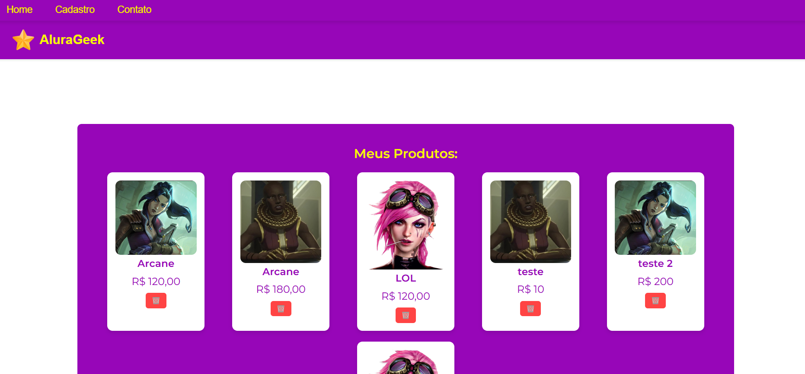
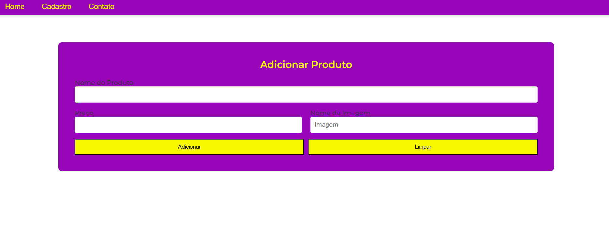
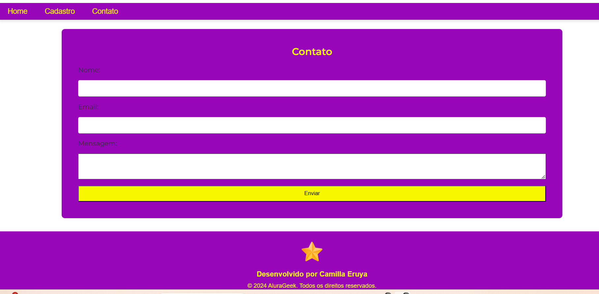
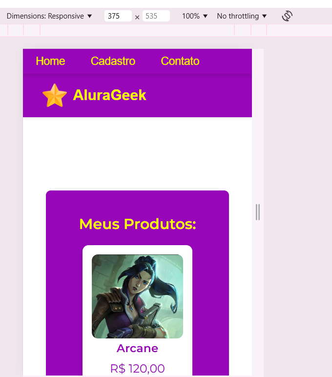
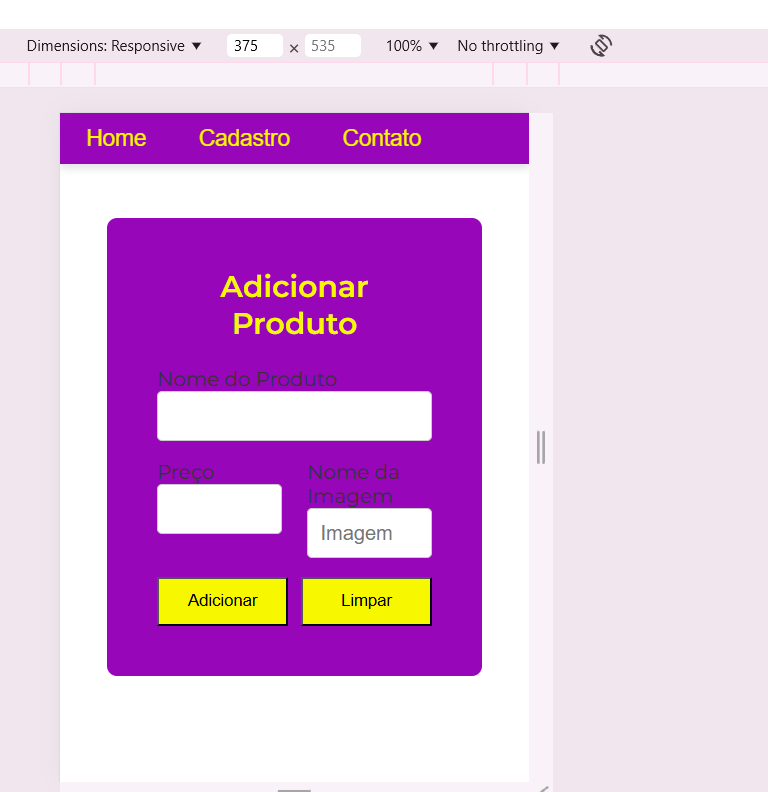
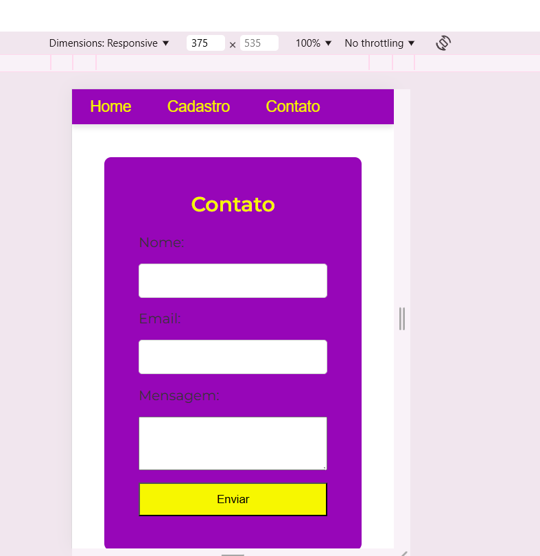

# Challenge AluraGeek

## Descrição

Este projeto é uma atividade do curso Oracle e Alura. Consiste em aplicar os conhecimentos aprendidos durante o curso .
Criar um marketing que consiste em criar cards (loja) e a criação pelo usuario de novos anuncios e a parte de contato . assim sistematizando a utilização do CRUD.

## Tecnologias Utilizadas

## Imagens Projeto

https://github.com/CamillaEruya/desafioGeek/tree/main/img

img/print1.png

